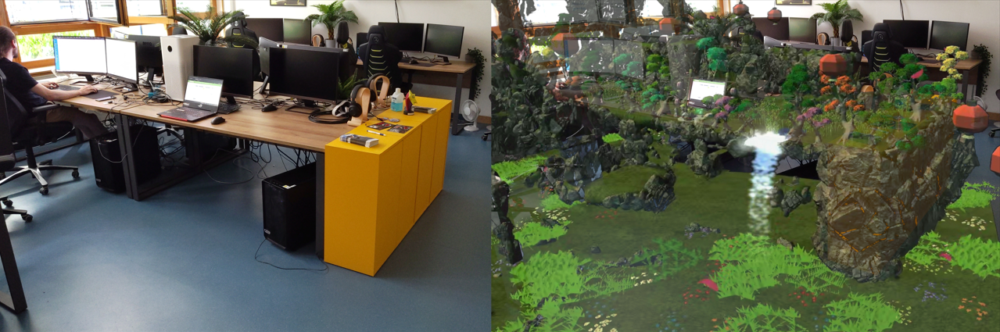

# Zen Office

Procedurally generate a relaxing nature environment on the HoloLens 2,
while keeping work surfaces free. 
Built for the MVG-project at [HBRS](https://www.h-brs.de/de/inf/studienangebot/master/visual-computing-and-games-technology).

[Installation](MRTK%20Tutorial) 
[Effectiveness study](Auswertung)

[Contact](mailto:zenoffice.eval@gmail.com)